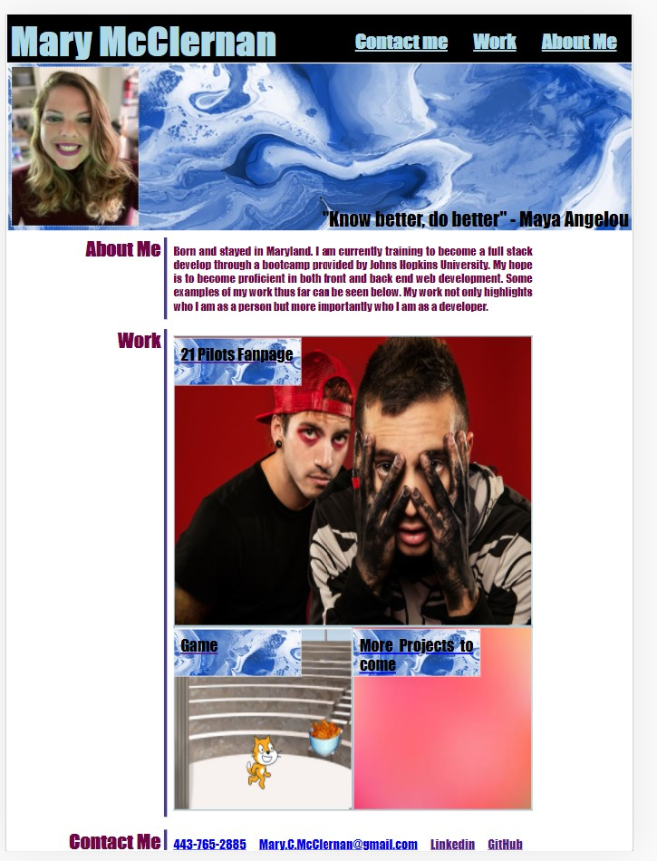

# My-Portfolio
 
# Overview
The purpose of this project was to create a portfolio which provides a brief introduction into who I am as a developer and highlight my skills and talent by showcasing my best work. 

# Usage
All you need to view my portfolio is internet access and a web browser!
Follow this link (https://mcm1015.github.io/My-Portfolio/)
Website Preview: 

If you want to view the working code follow this link [HTML CODE](index.html) and this link [CSS CODE](./assets/css/style.css)

# Credits
reset.css style paged was copied from instructor provided files from the Johns Hopkins University Coding Bootcamp. 

Adding call link(https://www.elegantthemes.com/blog/wordpress/call-link-html-phone-number)

Display text over image(https://www.tutorialrepublic.com/faq/how-to-position-text-over-an-image-using-css.php)

css links(https://www.w3schools.com/css/css_link.asp)

css text decoration(https://www.w3schools.com/cssref/pr_text_text-decoration.asp)

flexbox(https://css-tricks.com/snippets/css/a-guide-to-flexbox/)

# License
The [MIT](LICENSE) license was chosen for this project. 
